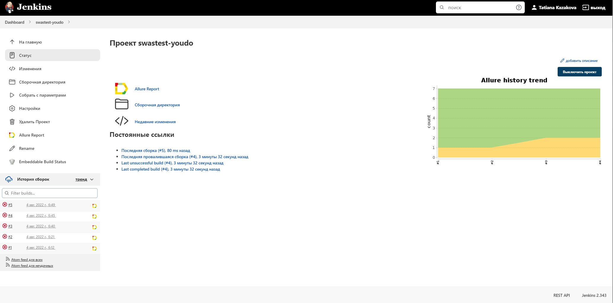
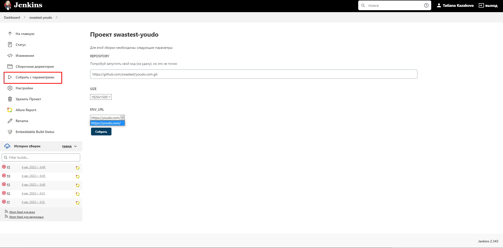
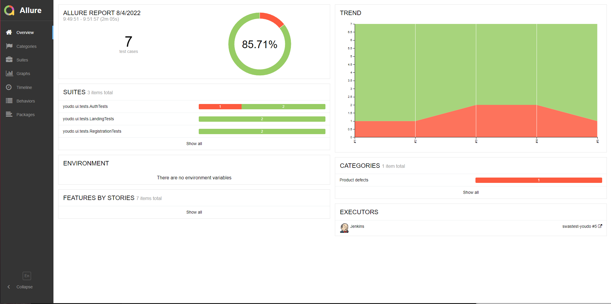
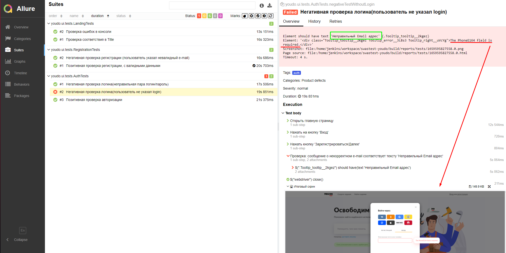
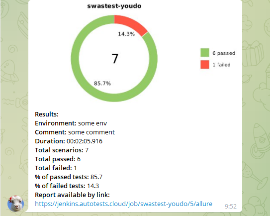
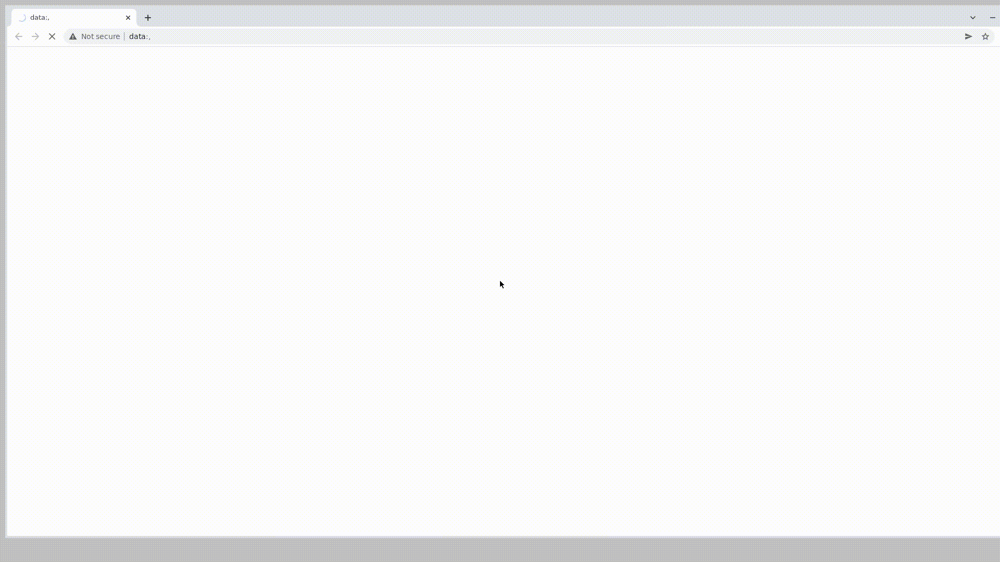

# Проект по автоматизации тестирования веб-приложения <a target="_blank" href="https://youdo.com/">YouDo</a>
<p align="center">

</p>


## :floppy_disk: Содержание:

- <a href="#computer-технологии-и-инструменты">Технологии и инструменты</a>
- <a href="#notebook_with_decorative_cover-реализованные-проверки">Реализованные проверки</a>
- <a href="#electric_plug-сборка-в-Jenkins">Сборка в Jenkins</a>
- <a href="#arrow_forward-запуск-из-терминала">Запуск из терминала</a>
- <a href="#open_book-allure-отчет">Allure отчет</a>
- <a href="#robot-отчет-в-telegram">Отчет в Telegram</a>
- <a href="#film_projector-видео-примеры-прохождения-тестов">Видео примеры прохождения тестов</a>

***

## :computer: Технологии и инструменты
<p align="center">


</p>

***

## :notebook_with_decorative_cover: Реализованные проверки
- Позитивная проверка Регистрации
- Негативная проверка Регистрации (некорректный e-mail)
- Проверка авторизации
- Авторизация с неверным паролем
- Проверка сообщения о незаполненном логине при авторизации (здесь обнаружен баг)
- Проверка соответствия Title на главной странице
- Проверка консоли браузера

***

## :electric_plug: Сборка в Jenkins
### <a target="_blank" href="https://jenkins.autotests.cloud/job/swastest-youdo//">Сборка в Jenkins</a>
<p align="center">

</p>  

***

## :arrow_forward: Запуск из терминала
Локальный запуск:
```
gradle clean test -Dhost=local 
```
## :gear: Запуск тестов с выбором параметров


Удаленный запуск:
```
clean
test
-Dhost=remote
-DbrowserName=${BROWSERNAME}
-DbrowserVersion=${VERSION}
-DbrowserSize=${BROWSERSIZE}
-DenvUrl=${ENV_URL}
```

- -Dbrowser - можно выбрать браузер, который необходимо открыть именно вам
  (chrome,
  opera,
  firefox,
  safari)
- -DbrowserVersion - выберете нужную версию браузера
- -DbrowserSize - возможность управлять разрешением (1920x1080,
  1366x768,
  1280x1024,
  1280x800,
  1024x768)
- -DenvUrl - здесь вы можете выбрать нужное окружение

Так же доступны запуски отдельных тестов, по тегу:
```
clean auth - запускает тесты Авторизации
clean reg - запускает тесты Регистрации 
```

***

## :open_book: Allure отчет
- ### Главный экран отчета
<p align="center">

</p>

- ### Страница с проведенными тестами
*Можно подробно разобрать каждый шаг тест кейса, сбоку отображаются все шаги и тестовые данные*

*Наглядно указываются ошибки, которые были обнаружены*
<p align="center">

</p>

***

## :robot: Отчет в Telegram
<p align="center">

</p>

***
## :film_projector: Видео примеры прохождения тестов
> К каждому тесту в отчете прилагается видео. Одно из таких видео представлено ниже.
<p align="center">
  
</p>
